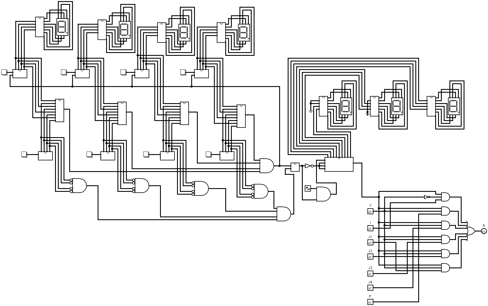

# Sistema de Segurança Residencial (Circuitos Lógicos)
#### Projeto final da disciplina Laboratório de Circuitos Lógicos.

## Introdução

Fazendo uso de conceitos (e práticas) desenvolvidos desde o primeiro experimento, foi implementado, utilizando a linguagem Verilog, um Sistema de Segurança Residencial Automático através da detecção de violação na residência e um sistema de senhas.

## Objetivos 

O sistema de segurança residencial implementado com linguagem de descrição de hardware deve funcionar da seguinte maneira:  

- a) Através de uma senha de 4 dígitos o usuário pode habilitar/desabilitar o sistema de segurança. A senha deve ser mostrada em um display.
- b) Implementar uma forma simples do usuário digitar a senha, como um botão para cada dígito em um intervalo de 0 a 9, no sistema de numeração decimal.
- c) Caso a senha esteja correta, é necessário adicionar um tempo de espera antes que o alarme fique ativado.
- d) A casa deve possuir uma planta arquitetônica definida, em que nas portas, janelas ou qualquer local que permita a entrada de pessoas, um sensor deve ser instalado. Caso o alarme esteja ativado, a violação de qualquer um desses locais deve disparar um alarme, teremos também sensores no portão principal na porta de entrada da casa , além de ter a cerca elétrica que funcionará como sensor de detecção de invasores.
- d) Caso o alarme seja ativado, o dono só poderá desativar através da senha, caso disparado o alarme irá soar um som de aviso e enviará uma mensagem para o celular da vítima sobre o ocorrido.

## Visualização do Projeto

### Alguma Dúvida? Entre em contato comigo:
- [Me envie um e-mail](alysson.barbosa@ee.ufcg.edu.br)

